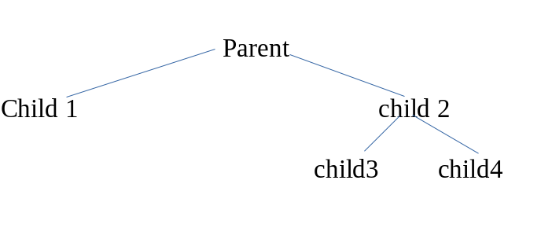

## Write a C program which will create child processes in the following tree format. Make sure that the output of print statement generated by various child and parent processes strictly followed any one of the following  sequence.

## Output:

Child 3 My id is ___ and my parent id is _____.

Child 4 My id is ___ and my parent id is _____.

Child 2 My id is ___ and my parent id is _____.

Child 1 My id is ___ and my parent id is _____.

Parent Process my id is ___ and my parent id is _____.

or

Child 4 My id is ___ and my parent id is _____.

Child 3 My id is ___ and my parent id is _____.

Child 2 My id is ___ and my parent id is _____.

Child 1 My id is ___ and my parent id is _____.

Parent Process my id is ___ and my parent id is _____.

or

Child 1 My id is ___ and my parent id is _____.

Child 3 My id is ___ and my parent id is _____.

Child 4 My id is ___ and my parent id is _____.

Child 2 My id is ___ and my parent id is _____.

Parent Process my id is ___ and my parent id is _____.

or

Child 1 My id is ___ and my parent id is _____.

Child 4 My id is ___ and my parent id is _____.

Child 3 My id is ___ and my parent id is _____.

Child 2 My id is ___ and my parent id is _____.

Parent Process my id is ___ and my parent id is ____